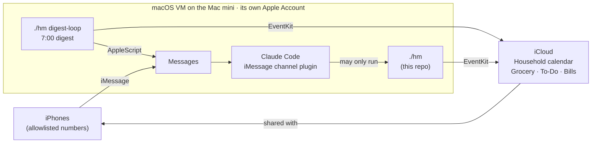

# Family Hub

Text a contact called **Family Hub** to run the house. Claude reads the
message, updates the family's shared **Apple Calendar** and **Reminders**
lists, and texts back. Every morning it sends a digest of the day: clashes,
events, bills coming up and anything due.

It runs on a Mac mini at home, sandboxed in a macOS virtual machine, and it
can only do one thing: run this project's command-line tool.

> A sample conversation (made-up details):
>
> **Me:** add soccer saturday 2-3 at field 4  
> **Family Hub:** Added Soccer, Sat Oct 3, 2:00–3:00 PM at Field 4. Heads up: that overlaps Sam's dentist 2:30–3:00.
>
> **Me:** put milk, eggs and rye bread on the grocery list  
> **Family Hub:** Added milk, eggs and rye bread to Grocery.
>
> **Me:** electric bill is paid  
> **Family Hub:** Done: Electric. Next due Sun Nov 1.
>
> **Family Hub, 7:00 AM:** Today Mon Oct 5: no conflicts. BILLS DUE: Water (due tomorrow). HOUSEHOLD: 5:30 PM Piano…

## What it does

- **Calendar:** add, move and delete events on a shared Household calendar,
  including repeating ones ("piano every Tuesday until December"), and warn
  about clashes with each person's own calendar.
- **Lists:** Grocery, To-Do and Bills are shared Reminders lists, so they're
  the normal lists on everyone's iPhone. Paying a monthly bill moves it to
  next month.
- **Photos:** text a picture of a school calendar or party invite and it lists
  the events it found, then asks before adding them.
- **Morning digest** by iMessage at 7:00.
- **Group chat:** in a thread with both of us it only answers when addressed
  as @Family Hub, so we can still talk to each other there.
- **Downtime-safe:** when it restarts, it catches up on texts sent while it
  was off.

## How it works



- **`home_manager/`**: a plain Python command-line tool (`hm`). It is the only
  part that touches Apple's data, through EventKit via PyObjC.
- **`hub/`**: the Claude Code session that turns texts into `hm` commands. It
  holds the instructions (`CLAUDE.md`), the locked-down permissions
  (`hub-settings.json`) and the start script.
- The calendar and lists belong to our own iCloud accounts and are only
  *shared* with the hub's account, so the family's data never depends on it.

## Security design

The hub acts on text messages and on whatever arrives with them (photos,
forwarded texts), and any of that can contain instructions. So it's built
assuming someone will eventually try to talk it into something:

| Layer | What it does |
|---|---|
| Separate Apple Account | The hub reads only texts sent *to it*, never a family member's own messages |
| Allowlist | Only our numbers (and one group chat) reach Claude. It's read once at startup, so no text can change it |
| One allowed command | Claude Code runs in `dontAsk` mode: it may run `./hm ...` and reply by iMessage, and everything else is refused without a prompt (no file edits, web access, other commands, or reading config) |
| Narrow write access | `hm` only changes the Household calendar and the shared lists; personal calendars are read-only |
| Confirmation | Deleting a repeating series, clearing a list or removing a bill needs a "yes" first |
| Sandbox | It runs in a macOS VM with no shared folders, so it can't reach the host Mac's files or accounts |
| No money | Apple Pay and Apple Cash don't work in a VM, and nothing here can spend |
| Secrets outside git | Phone numbers, names and settings live in `~/.config/home-manager/` and `hub/CLAUDE.local.md`, both ignored |

Worst realistic case: some wrong or deleted calendar entries, which iCloud can
restore.

## How it was built (and what went wrong)

I built this with Claude as a pair programmer, over a couple of evenings.

1. **Version 1** emailed a morning summary of two Google Calendars with
   conflicts flagged. It's the first commit.
2. **The hub** added writing to a shared calendar, lists and bills, plus
   texting Claude through the new Claude Code iMessage channel.
3. **Switched from Google to Apple** so everything shows up in the phones'
   own apps. Apple has no web API for Reminders, so the hub needs a Mac
   signed into its own Apple Account, which is why it lives in a macOS VM.
4. **Moved out of my monorepo** into this repo, history intact.

Things that bit along the way:

- **Apple Accounts can't be created inside a VM,** and Apple locks new
  accounts that show up in several places at once. What worked was creating
  it once from a temporary macOS user on real hardware.
- **macOS kept reporting "no access" to Reminders** for the rest of the
  process after access was granted. `apple.py` now remembers grants made
  during the same run.
- **`--channels` takes every following argument as a channel name,** so the
  startup prompt was silently treated as a second channel. The prompt now
  comes first.
- **The plugin was installed with "local" scope,** which ties it to one
  folder, so it vanished after the move. It has to be installed at user scope.
- **Long-running sessions get more expensive with every message.** The hub
  restarts Claude at 3 AM, and a startup check answers anything sent in
  between.
- **The core has no Apple calls** (time parsing, repeats, conflicts, list
  matching), and an in-memory fake stands in for EventKit, so the 34 tests
  run on any machine, including Linux.

## Set it up

The full walkthrough is in **[`hub/README.md`](hub/README.md)**: the hub's
Apple Account, the VM, sharing the calendar and lists, the iMessage plugin
and the allowlist. Budget about an hour.

## Limits

- The Claude Code iMessage channel is a research preview, and it uses your
  Claude subscription's limits.
- The group chat isn't included in the startup catch-up yet.
- AppleScript can't send tapbacks or threaded replies, so replies are plain.

## Reference

### Requirements

macOS, signed into an Apple Account that can see the calendar and lists, with
Calendars and Reminders access granted to Terminal (`hm setup` asks). The tests
run anywhere, including Linux, because they use an in-memory fake instead of
EventKit.

### Commands

Run from this folder with `uv run python -m home_manager ...`, or from `hub/`
as `./hm ...`. `uv` installs Python 3.12+ and PyObjC on first use.

```sh
hm setup                 # ask for Calendars and Reminders access; check names and sharing
hm calendars             # calendars and Reminders lists this account can see
hm now                   # local date and time
hm summary [--date YYYY-MM-DD] [--send]     # the digest; --send texts it to [digest] to
hm digest-loop           # sends the digest every morning (start-hub.command runs it)
hm chats                 # iMessage chat ids of allowlisted family members
```

Calendar (reads every calendar, but only changes Household):

```sh
hm cal list [--date YYYY-MM-DD] [--days N]
hm cal find soccer
hm cal add Soccer game --start "2026-10-03 14:00" --end 15:00 --location "Field 4"
hm cal add Beach trip --date 2026-10-09 --through 2026-10-11
hm cal add Piano --start "2026-10-06 16:30" --minutes 45 --repeat weekly --until 2026-12-15
hm cal update <id> --start "2026-10-03 16:00"      # keeps the length
hm cal update <id> --start "2026-10-13 17:00" --future   # this and every later repeat
hm cal delete <id> [--future]
```

Reminders lists:

```sh
hm list names
hm list show Grocery [--done]
hm list add Grocery milk "rye bread"
hm list add Bills Electric --due 2026-10-01 --repeat monthly --notes "about \$120"
hm list add To-Do "Call plumber (Nick)" --due 2026-09-30 --at 09:30
hm list done Bills electric           # repeating items move to their next due date
hm list undo Grocery eggs | list remove Grocery 'rye bread' | list clear Grocery
hm list edit To-Do plumber --due 2026-10-02 [--no-due] [--repeat weekly] [--title ...]
hm list due [--days 7]                # anything due soon, on every list
```

Every command has `--help`. List items can be named by title, a unique piece of
the title, or the `#id` that `list show` prints.

### Tests

```sh
uv run pytest
uv run pytest tests/test_cli.py::test_grocery_list    # one test
```

### Code layout

- `home_manager/apple.py`: the only code that talks to Apple, through EventKit
- `home_manager/household.py`: turns command options into event times and repeats
- `home_manager/reminders.py`: list items: matching, due dates, repeats, formatting
- `home_manager/summary.py`: merges shared events, finds conflicts, formats the digest
- `home_manager/messages.py`: sends iMessages and looks up family chat ids
- `home_manager/config.py`: the optional config file
- `hub/`: the iMessage family hub (`hub-settings.json` locks the Claude session down; `start-hub.command` starts it; `README.md` is the setup guide)
- `tests/fake_apple.py`: an in-memory stand-in for `apple.py`, used by the tests

The first version (morning email from two Google Calendars through the Google
APIs) is the repo's first commit.

## License

MIT. See [LICENSE](LICENSE).
